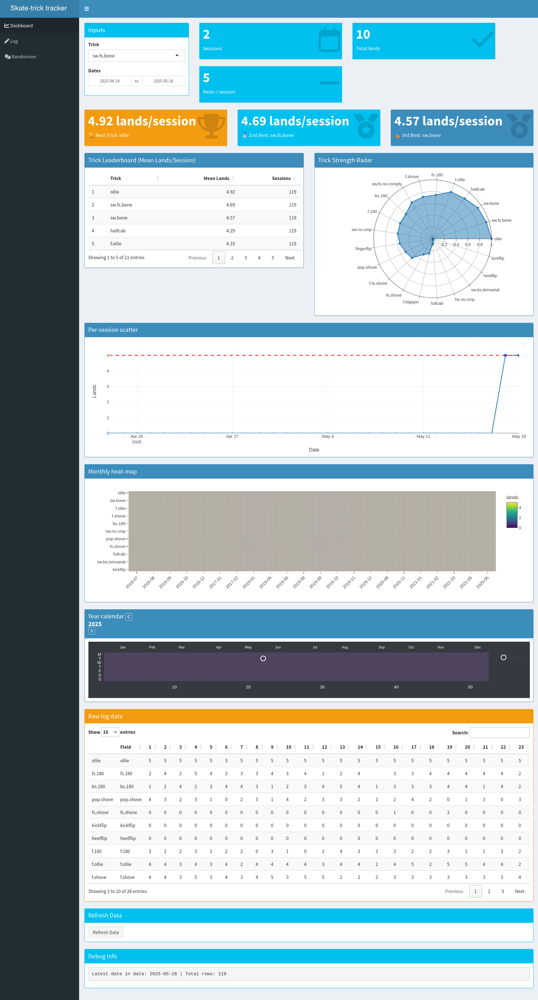
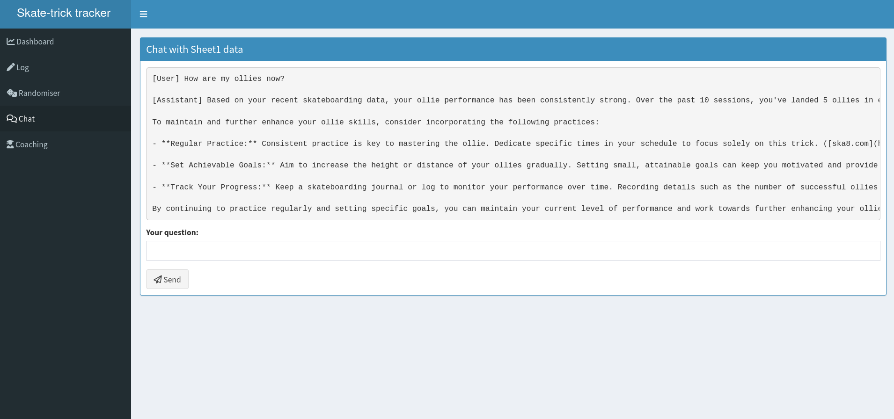
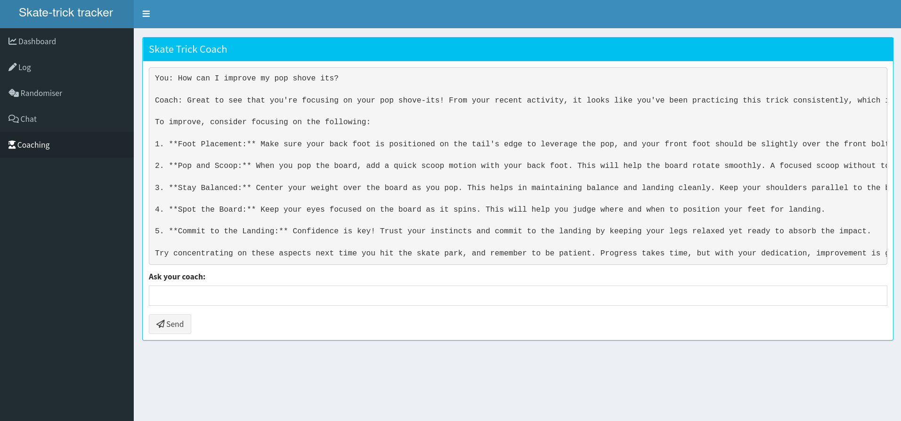

# 🛹 Sk8bro - Skateboard Trick Tracker

Sk8bro is an interactive Shiny dashboard application designed for skateboarders to track, visualize, and analyze their progress across various tricks. The app connects to Google Sheets to store and retrieve skating session data, making it easy to log new sessions and visualize progress over time.





## ✨ Features

- **Interactive Dashboard**: Visualize your skateboarding progress with dynamic plots and charts
- **Session Logging**: Track dates, locations, tricks, and number of successful landings
- **Trick Analytics**: View per-session scatter plots, monthly heatmaps, and yearly calendars
- **Randomizer**: Generate random trick practice lists to keep your sessions fresh
- **AI-Powered Chat**: Get insights and coaching tips based on your progression data
- **Google Sheets Integration**: All data is stored in Google Sheets for easy access and editing
- **Mobile-Friendly**: Use on your phone at the skatepark to log sessions on the go

## 🚀 Getting Started

### Prerequisites

- R (>= 4.0.0)
- RStudio (recommended for local development)
- Google account for sheets integration
- OpenAI API key (for chat features)

### Installation

#### Option 1: Local Installation

1. Clone this repository:
```bash
git clone https://github.com/Shuyib/skateboarding-consistency-proj.git
cd sk8bro
```

2. Install required R packages:
```r
install.packages(c(
  "shiny", "shinydashboard", "googlesheets4", "dplyr",
  "tidyr", "plotly", "lubridate", "DT", "rlang",
  "tidychatmodels"  # Optional, for AI features
))
```

3. Set up Google Sheets authentication:
   - For local development: Run the app once and follow OAuth prompts
   - For deployment: Create a service account and save the JSON key

4. (Optional) For AI features, create a `.Renviron` file in the project root:
```
OPENAI_API_KEY=your_api_key_here
```

#### Option 2: Docker Installation

1. Clone the repository and navigate to the project directory
2. Build the Docker image:
```bash
docker build -f Dockerfile.app -t sk8bro .
```

3. Run the container:
```bash
docker run -p 3838:3838 -e GS4_SA_JSON="$(cat /path/to/service-account.json)" -e OPENAI_API_KEY="your_api_key" sk8bro
```

## 📊 Usage

### Setting Up Your Google Sheet

1. Create a new Google Sheet or use the [template](https://docs.google.com/spreadsheets/d/1g39AiffkNsfs_fZK4aFb6pQaiB2euZlp4GYq9CQhA98/edit?usp=sharing)
2. Share the sheet with your service account email (for deployed apps)
3. Replace the `SHEET` URL in the app with your sheet's URL

### Running the App

#### Local Development
```r
shiny::runApp("/path/to/sk8bro/app.R")  # Basic version
# or
shiny::runApp("/path/to/sk8bro/app_genai.R")  # Version with AI features
```

#### Access Deployed App
If deployed to shinyapps.io, access via the provided URL.

### App Features

1. **Dashboard Tab**
   - Select tricks and date ranges to visualize progress
   - View session stats, per-session scatter plots, and heatmaps
   - See trick leaderboards and strength radar charts

2. **Logging Tab**
   - Enter new skating sessions with date, location, and trick details
   - Update existing sessions

3. **Randomizer Tab**
   - Generate random trick practice lists
   - Customize the number of tricks to include

4. **Chat Tab** (AI Version Only)
   - Ask questions about your skating data
   - Get insights and analysis based on your progression

5. **Coaching Tab** (AI Version Only)
   - Get personalized coaching advice based on your trick data
   - Ask questions about improving specific tricks

## 🐳 Docker Deployment

The included `Dockerfile.app` allows for containerized deployment:

```bash
# Build the image
docker build -f Dockerfile.app -t sk8bro .

# Run locally
docker run -p 3838:3838 sk8bro

# Access at http://localhost:3838
```

For production deployment, consider using environment variables for secrets:

```bash
docker run -p 3838:3838 \
  -e GS4_SA_JSON="$(cat /path/to/service-account.json)" \
  -e OPENAI_API_KEY="your_api_key" \
  sk8bro
```

## 🛠️ Customization

### Adding New Tricks

New tricks are automatically added when you log them in the Logging tab. Simply select "<new>" in the dropdown or type a new trick name.

### Modifying the UI

To customize the UI (colors, layouts, etc.), edit the `ui` definition in `app.R` or `app_genai.R`.

## 🤝 Contributing

Contributions are welcome! Please feel free to submit a Pull Request.

1. Fork the repository
2. Create your feature branch (`git checkout -b feature/amazing-feature`)
3. Commit your changes (`git commit -m 'Add some amazing feature'`)
4. Push to the branch (`git push origin feature/amazing-feature`)
5. Open a Pull Request

## 📄 License

This project is licensed under the Creative Commons Zero v1.0 Universal - see the LICENSE file for details.

## 🙏 Acknowledgements

- [Shiny](https://shiny.rstudio.com/) for the reactive web framework
- [googlesheets4](https://googlesheets4.tidyverse.org/) for Google Sheets integration
- [plotly](https://plotly.com/r/) for interactive visualizations
- [OpenAI](https://openai.com/) for AI capabilities
- All the skateboarders who provided feedback and testing

---

Created with 🛹 by Shuyib
